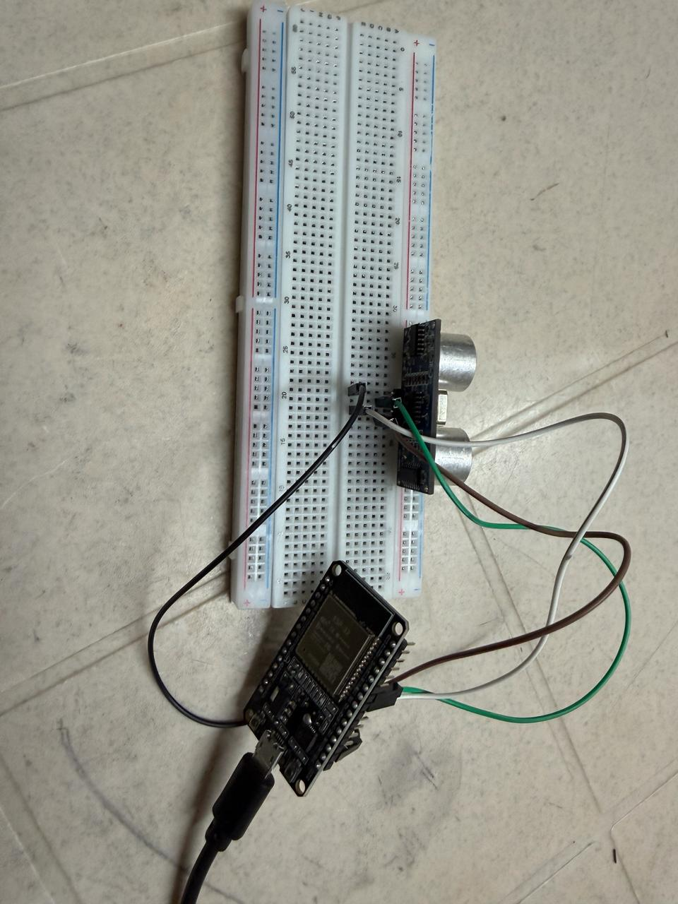
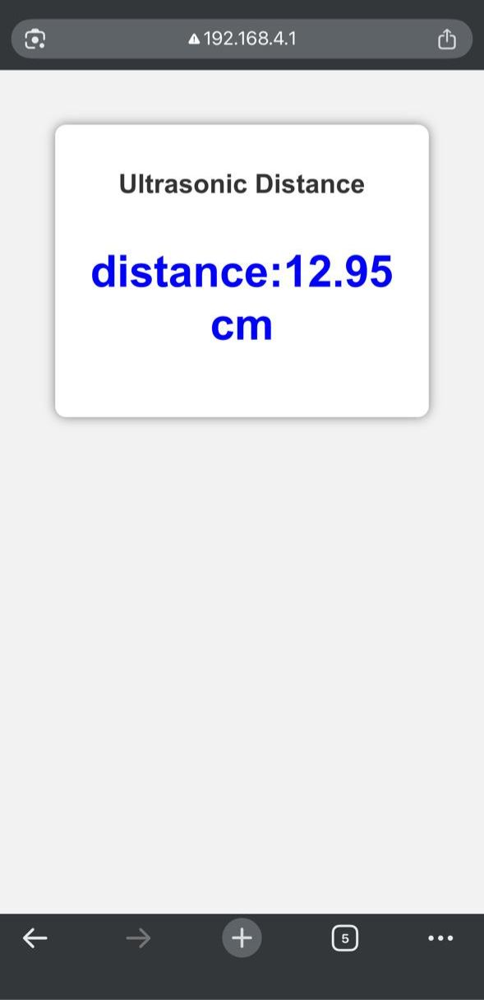

# 📏 ESP32 Ultrasonic Distance Monitor

This project uses an **ESP32** and an **HC-SR04 Ultrasonic Sensor** to measure distance and display the readings on a web page hosted by the ESP32 over Wi-Fi.

---

## 🚀 Features

- 📶 ESP32 operates as a Wi-Fi Access Point
- 📏 Real-time distance measurement
- 📱 View distance from any smartphone or laptop connected to the ESP32 Wi-Fi
- ⚡ Lightweight web interface
- 🔄 Continuous distance updates

---

## 🛠️ Components Used

- ESP32 Development Board
- HC-SR04 Ultrasonic Sensor
- Breadboard
- Jumper Wires
- USB Cable

---

## 🔌 Circuit Connections

| HC-SR04 Pin | ESP32 Pin |
|--------------|-----------|
| VCC | Vin |
| GND | GND |
| TRIG | GPIO 5 |
| ECHO | GPIO 18 |

*(Update the GPIO pins if your wiring is different.)*

---

## 📷 Circuit Setup



---

## 🌐 Web Interface



---

## ▶️ How to Use

1. Upload the code to the ESP32.
2. Power the ESP32.
3. Connect your phone or laptop to the ESP32 Wi-Fi network.
4. Open the IP address shown in the Serial Monitor.
5. View live distance measurements.

---

## 📂 Project Structure

```
ESP32-Ultrasonic-WebServer
│
├── ESP32_Ultrasonic_WebServer.ino
├── README.md
└── images
    ├── circuit.jpeg
    └── output.jpg
```

---

## 📚 Libraries Used

- WiFi.h
- WebServer.h

---

## 🔮 Future Improvements

- OLED Display Integration
- Obstacle Detection Alerts
- Mobile App Support
- Data Logging
- Buzzer for Distance Warning

---

## 👨‍💻 Author

**Vishal Varma**

B.Tech Electronics & Communication Engineering (ECE)

Interested in Embedded Systems, IoT and AI.
